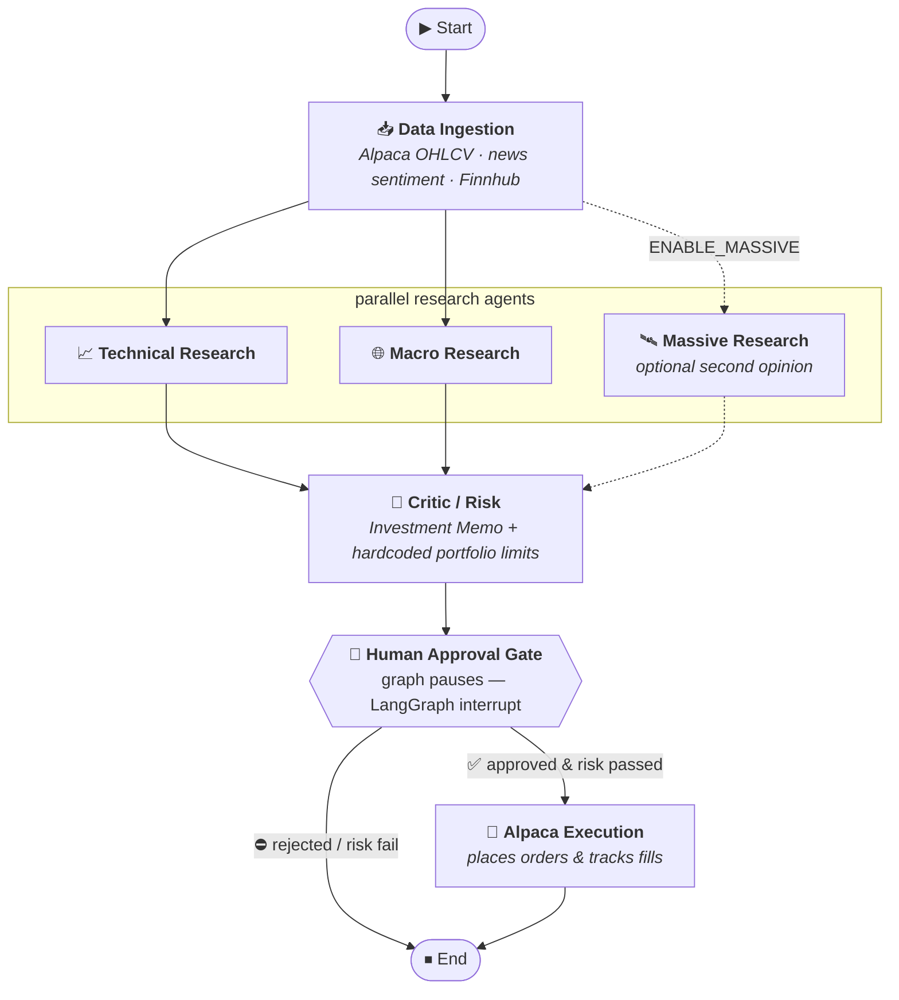

# Burry

A multi-agent trading orchestrator for [Alpaca](https://alpaca.markets), built on
**LangGraph**. Named after Michael Burry — research first, conviction second,
risk limits always.

## Pipeline



> The **Massive Research** node (dotted) only joins the fan-out when
> `ENABLE_MASSIVE=true`; otherwise the pipeline runs Technical + Macro only.

## Layout

| Path | Role |
|------|------|
| `src/burry/config.py` | Settings from env / `.env` (pydantic-settings) |
| `src/burry/models.py` | **Provider-agnostic** LLM factory (Anthropic *or* OpenAI) |
| `src/burry/state.py` | `TradingState` — the shared graph state |
| `src/burry/tools/` | Alpaca (data + execution), Finnhub, sentiment clients |
| `src/burry/prompts/` | **Every agent prompt as a versioned `.md` file** + the loader |
| `src/burry/risk/limits.py` | Deterministic, hardcoded portfolio limits (no LLM) |
| `src/burry/nodes/` | One module per box: ingestion, research, critic, approval, execution |
| `src/burry/graph.py` | Wires the `StateGraph` together (exposes `graph`) |
| `main.py` | CLI runner with the human-in-the-loop pause |

## Setup

```bash
cd ~/Development/Burry
python -m venv .venv && source .venv/bin/activate
pip install -r requirements.txt
cp .env.example .env   # then fill in your keys
```

### Choosing a provider

Set `LLM_PROVIDER=anthropic` (default, uses `claude-opus-4-8`) or
`LLM_PROVIDER=openai`. The factory in `models.py` is the only place that knows
the difference — agents just call `get_llm(role)`.

## Prompts as a framework

No agent prompt is hardcoded in Python. Each one lives as a Markdown file in
`src/burry/prompts/`, so prompts are versioned, diffable, and editable by
non-engineers without touching node code.

Each file supports optional YAML-style **frontmatter** to carry its own config:

```markdown
---
role: technical
temperature: 0.2
---
You are a technical analyst...
```

Nodes load them through the registry:

```python
from burry.prompts import load_prompt

p = load_prompt("technical_research")
p.text          # prompt body (frontmatter stripped)
p.role          # "technical"
p.temperature   # 0.2
p.render(ticker="AAPL")   # optional {placeholder} substitution
```

Current prompts: `technical_research.md`, `macro_research.md`, `critic.md`,
`massive_research.md`. To add a new agent, drop a `.md` file in the folder and
`load_prompt("<name>")` — no code change to the loader.

## Optional: Massive research step

[Massive.com](https://massive.com) is a financial market-data API. It's wired in
as an **optional third research agent** that runs in parallel with Technical &
Macro and gives the critic a cross-asset "second opinion" (OHLC bars, news with
sentiment, fundamentals, macro indicators).

It is **off by default** — the base flow is unchanged. To enable:

```bash
# in .env
ENABLE_MASSIVE=true
MASSIVE_API_KEY=...
```

When enabled, `graph.py` adds the `massive` node to the fan-out and the critic
folds its analysis in. When disabled, none of the Massive code is imported.

## Run

```bash
python main.py AAPL MSFT NVDA
```

The graph runs ingestion → parallel research → critic, then **pauses** and prints
the investment memo, proposed orders, and the risk-check result. Type `y` to
resume into execution, anything else to stop.

Alpaca defaults to **paper trading** (`ALPACA_PAPER=true`). Flip to live only
when you mean it.

## LangGraph dev server

`langgraph.json` points at `src/burry/graph.py:graph`, so you can also use the
LangGraph CLI / Studio:

```bash
pip install "langgraph-cli[inmem]"
langgraph dev
```

## Notes / TODO

- Sentiment is a headline-count stub — wire in a real scorer or Finnhub
  `news_sentiment`.
- Risk `notional` estimation from `qty` needs a live price multiply (`limits.py`).
- Swap `MemorySaver` for `SqliteSaver`/`PostgresSaver` in `graph.py` to persist
  threads across restarts.
- ⚠️ Nothing here is investment advice; test on paper accounts only.
```
