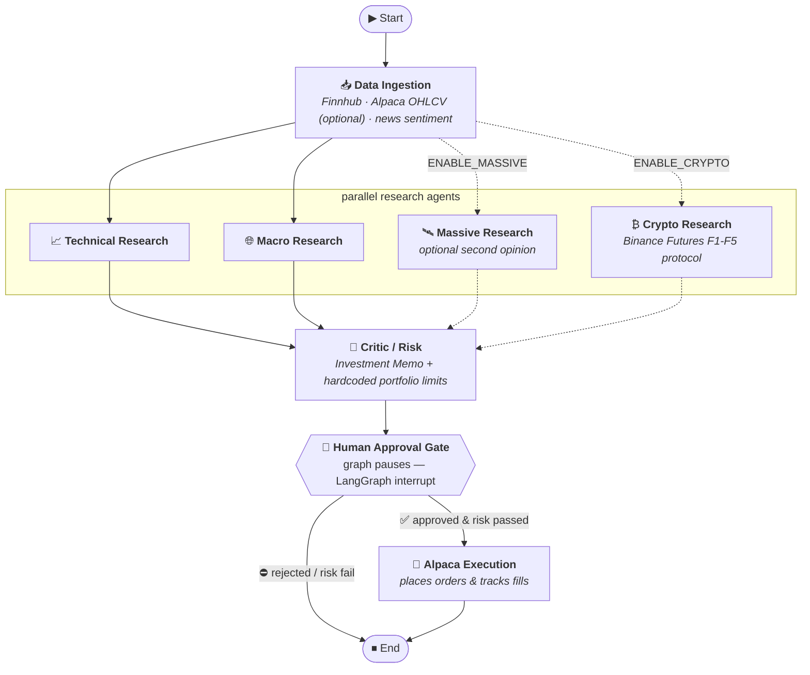

# Burry

A multi-agent trading orchestrator for [Alpaca](https://alpaca.markets), built on
**LangGraph**. Named after Michael Burry — research first, conviction second,
risk limits always.

## Pipeline



> Dotted nodes are **optional** — each is only added to the graph when its flag is enabled.
> The base flow runs Technical + Macro only.
>
> | Flag | Default | What it adds |
> |------|---------|--------------|
> | `ENABLE_MASSIVE=true` | off | Massive.com cross-asset second opinion |
> | `ENABLE_CRYPTO=true`  | off | Binance Futures F1-F5 crypto protocol |

## Layout

| Path | Role |
|------|------|
| `src/burry/config.py` | All settings from env / `.env` (pydantic-settings) |
| `src/burry/models.py` | Provider-agnostic LLM factory — Anthropic, OpenAI, Gemini, Ollama |
| `src/burry/state.py` | `TradingState` — shared graph state (stocks + crypto) |
| `src/burry/graph.py` | Wires the `StateGraph` together |
| `src/burry/nodes/ingestion.py` | Data pull — Finnhub always, Alpaca optional |
| `src/burry/nodes/research.py` | Technical + Macro agents (parallel) |
| `src/burry/nodes/crypto_research.py` | Binance Futures F1-F5 agent (optional) |
| `src/burry/nodes/massive_research.py` | Massive.com second-opinion agent (optional) |
| `src/burry/nodes/critic.py` | Reconciles all research → Investment Memo + orders |
| `src/burry/nodes/approval.py` | Human-in-the-loop interrupt gate |
| `src/burry/nodes/execution.py` | Places approved orders on Alpaca |
| `src/burry/tools/alpaca.py` | Alpaca OHLCV + order execution |
| `src/burry/tools/finnhub.py` | Fundamentals, metrics, quote, news, insider sentiment |
| `src/burry/tools/binance.py` | Binance public API — BTC macro, pair scan, 4H indicators |
| `src/burry/tools/sentiment.py` | Alpaca news sentiment (stub — replace with real scorer) |
| `src/burry/prompts/` | Every agent prompt as a versioned `.md` file |
| `src/burry/risk/limits.py` | Deterministic, hardcoded portfolio limits (no LLM) |
| `scripts/lookup.py` | CLI tool for manual Finnhub ticker lookups |
| `tests/` | Integration test suites for Finnhub and LLM providers |

## Setup

```bash
cd ~/Development/Burry
python -m venv .venv && source .venv/bin/activate
pip install -r requirements.txt
cp .env.example .env   # then fill in your keys
```

### LLM Providers

Set `LLM_PROVIDER` in `.env`. The factory in `models.py` is the only place that
knows the difference — agents just call `get_llm(role)`.

| Provider | Env var | Notes |
|----------|---------|-------|
| `gemini` | `GEMINI_API_KEY` | Default — gemini-2.5-flash, fast and free-tier friendly |
| `anthropic` | `ANTHROPIC_API_KEY` | claude-opus-4-8, requires paid credits |
| `openai` | `OPENAI_API_KEY` | gpt-4o |
| `ollama` | `OLLAMA_BASE_URL` + `OLLAMA_API_KEY` | Self-hosted via Ollama or Open WebUI |

Each provider supports per-role model overrides so different agents can use
different models:

```ini
# .env example — Gemini
LLM_PROVIDER=gemini
GEMINI_API_KEY=...
GEMINI_MODEL=gemini-2.5-flash          # default for all agents
GEMINI_MODEL_CRITIC=gemini-2.5-pro     # stronger model for the critic only

# .env example — Ollama via Open WebUI
LLM_PROVIDER=ollama
OLLAMA_BASE_URL=http://open-webui.yourdomain.com/ollama
OLLAMA_API_KEY=sk-...
OLLAMA_MODEL=qwen2.5:3b
OLLAMA_MODEL_CRITIC=qwen2.5:7b
```

### Alpaca is optional

Alpaca keys are not required to run the research pipeline. When absent:
- OHLCV data is skipped (technical agent notes the gap)
- Sentiment falls back to Finnhub news headlines
- Risk check runs against zero equity (conservative)
- Execution node is unreachable (approval gate stays closed)

### Finnhub data

`fetch_company_data()` returns 6 sections per ticker used by the research agents:

| Section | Contents |
|---------|----------|
| `profile` | Name, exchange, industry, IPO date, market cap |
| `metrics` | 130+ financial KPIs (P/E, margins, growth, ROE…) |
| `recommendation` | Analyst buy/hold/sell trends by month |
| `quote` | Real-time price, change %, day range |
| `news` | Recent headlines with source and summary |
| `insider_sentiment` | Monthly MSPR score (insider buying/selling pressure) |

Quick lookup from the CLI:

```bash
python scripts/lookup.py AAPL TSLA NDAQ
python scripts/lookup.py NDAQ --section quote
python scripts/lookup.py NDAQ --section metrics --limit 20
python scripts/lookup.py NDAQ --json
```

## Crypto Research Agent (Binance Futures)

Enable with `ENABLE_CRYPTO=true` in `.env`. Uses only Binance public endpoints —
no API key required for market data.

The agent follows the F1-F5 protocol:

| Phase | What it does |
|-------|-------------|
| F1 | BTC price, Fear & Greed Index, BTC dominance, funding rate → session bias |
| F2 | Scans top 50 futures for long/short candidates by RSI + EMA + funding criteria |
| F3 | 4H technical validation per candidate: EMA20/50/200 + RSI(14) computed locally |
| F4 | Entry filter — only proposes if success % > 60%, max 10% capital per position |
| F5 | Position management rules: SL trailing, 50% close at TP1, RSI-based full exit |

Session bias rules:
- **risk-on** — F&G ≥ 60 and BTC rising → longs eligible
- **risk-off** — F&G ≤ 40 or BTC down >2% → shorts only or no trade
- **neutral** — anything else

```ini
# .env
ENABLE_CRYPTO=true
CRYPTO_CAPITAL=1000   # session capital in USD (10% max per position)
```

## Prompts as a framework

No agent prompt is hardcoded in Python. Each lives as a Markdown file in
`src/burry/prompts/`, versioned and editable without touching node code.

Each file supports optional YAML-style **frontmatter**:

```markdown
---
role: technical
temperature: 0.2
---
You are a technical analyst...
```

Current prompts: `technical_research.md`, `macro_research.md`, `critic.md`,
`massive_research.md`, `crypto_research.md`.

To add a new agent: drop a `.md` file in the folder and call
`load_prompt("<name>")` — no changes to the loader.

## Run

```bash
# stocks only
python main.py AAPL MSFT NVDA

# with crypto enabled (set ENABLE_CRYPTO=true in .env first)
python main.py AAPL MSFT
```

The graph runs ingestion → parallel research → critic, then **pauses** and prints
the investment memo, proposed orders, and risk result. Type `y` to resume into
execution, anything else to stop.

Alpaca defaults to **paper trading** (`ALPACA_PAPER=true`). Flip to live only
when you mean it.

## Tests

```bash
# Finnhub integration (36 tests — hits real API)
pytest tests/test_finnhub.py -v

# LLM provider + connectivity (14 tests)
pytest tests/test_llm.py -v -s
```

## LangGraph dev server

`langgraph.json` points at `src/burry/graph.py:graph`:

```bash
pip install "langgraph-cli[inmem]"
langgraph dev
```

## Notes / TODO

- Sentiment is a headline-count stub — wire in a real scorer or Finnhub `news_sentiment`.
- Risk `notional` estimation from `qty` needs a live price multiply (`limits.py`).
- Swap `MemorySaver` for `SqliteSaver`/`PostgresSaver` in `graph.py` for persistent threads.
- Crypto execution node (Binance order placement) not yet implemented — analysis only.
- ⚠️ Nothing here is investment advice; test on paper accounts only.
